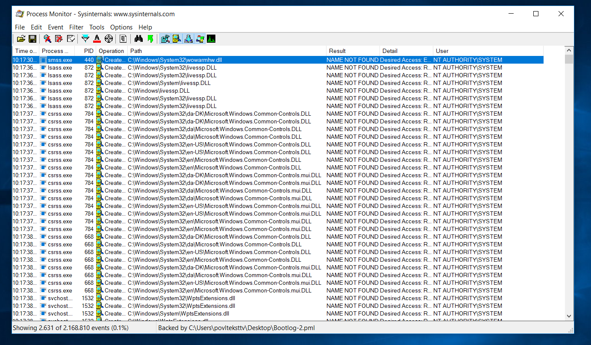
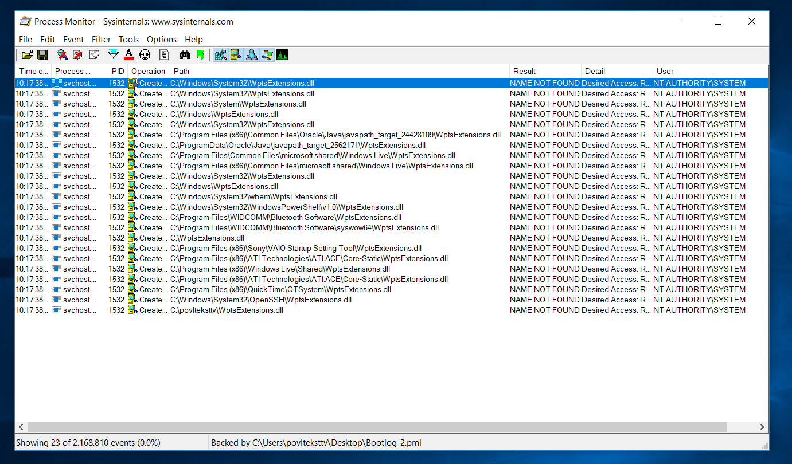

# POC: From User to SYSTEM

### How to detect what applications are looking for what DLL-files?
First, download Sysinternals *Process Monitor* https://docs.microsoft.com/en-us/sysinternals/downloads/procmon. This will allow us to not only see what process are running but also detect what ressources they are trying to load. Since a lot of applications run on startup, and since most of these programs are running with elevated privileges, it seems to be a good idea to enable *Boot Logging*.  

After restarting Windows and reopening Process Monitor, it will now recommend saving the data from the boot logging. Now for the filter. We are only interested in those lines where the *result* is "NAME NOT FOUND" and where *path* ends with ".dll". Laslty, make sure that the column *user* is shown. 

It is noticable how many process are using the DLL Search-Order and are not able to find the correct resources. This will of course vary a lot from system to system. One process that is going through the DLL Search-Order, and running as NT SYSTEM, is svchost.exe, that is looking for WptsExtensions.dll. In this next picture I have changed the previous *path* filter to only include files ending with WptsExtensions.dll. 

It is now clear how the DLL Search-Order is being utilized by the svchost.exe process, and where exactly it is trying to load the DLL-file from. 

**How would an adversary take advantage of this?**

