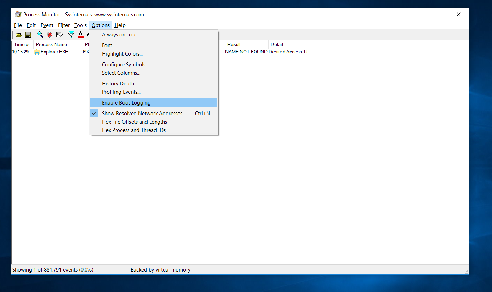
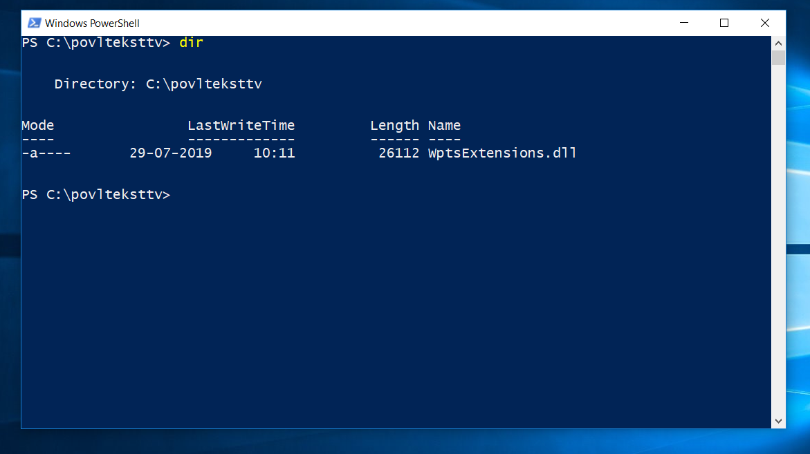
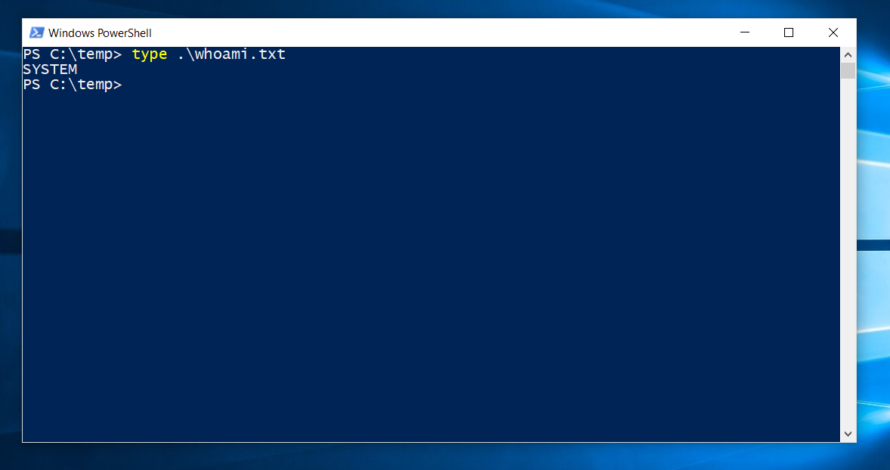

# POC: DLL Search-Order hijacking WptsExtensions.dll from svchost.exe 
(This have been tested to work on Windows 10) 

### Question 1: How to detect what applications are looking for what DLL-files?
First, download Sysinternals *Process Monitor* https://docs.microsoft.com/en-us/sysinternals/downloads/procmon. This will allow us to not only see what process are running but also detect what ressources they are trying to load. Now, enable *Boot Logging*. A lot of applications run on startup, and most of these programs are running with elevated privileges.  

After restarting Windows and reopening Process Monitor, it will now recommend saving the data from the boot logging. When these are saved it is time for the filter. Make sure to include *result* is "NAME NOT FOUND" and *path* ends with ".dll". Laslty, make sure that the column *user* is shown. 

It should now be noticable how many process are using the DLL Search-Order and are not able to find the correct resources. This will of course vary a lot from system to system. It is confirmed that svchost.exe is looking for WptsExtensions.dll and is running as NT SYSTEM. In the next picture I have changed the previous *path* filter to only include files ending with WptsExtensions.dll. 

It can clearly be confirmed that the DLL Search-Order is being utilized by the svchost.exe process, and where exactly it is trying to load the DLL-file from. 

### Question 2: How would an adversary take advantage of this? 
As seen by the picture below. All an adversary has to do is copy a DLL-file with the same name into a directory that is writable by an unprivileged user AND is being search by the DLL Search-Order. In this case I have created a directory called "c:\povlteksttv". 

Next time the system restarts, svchost.exe will go through the DLL Search-Order, find our .DLL-file anad load it into memory. The DLL that is used in this POC will, when loaded, write the name of the user and save it to a text file called "c:\temp\whoami.txt. 

